# 乐健体育跑步数据加密分析


----

**声明: 本教程仅供个人学习交流使用, 请勿用于非法用途**

---


## 1. 需要安装的工具及环境

下列工具请自行安装

**PC端**

1. python环境
2. frida-dexdump(360加固脱壳) : https://github.com/hluwa/frida-dexdump
3. jadx(反编译dex文件): https://github.com/skylot/jadx
4. IDA Pro(分析.so文件)
5. adb(安卓调试工具)
6. 夜神模拟器(安卓root环境)
6. frida-server (frida服务端): https://github.com/frida/frida/releases
----
**安卓端**

1. MT管理器(方便查看apk内文件)

## 2.乐健跑步成功上传的数据包示例

自由跑

```
{
    "appVersion": "3.1.1",
    "avePace": 644383,
    "calorie": 54,
    "deviceType": "Xiaomi MIX 2S",
    "effectiveMileage": 1.0942,
    "effectivePart": 1,
    "endTime": "2022-03-13 20:33:13",
    "gpsMileage": 1.0942,
    "keepTime": 705,
    "limitationsGoalsSexInfoId": "xxxxx",
    "paceNumber": 0,
    "paceRange": 0,
    // 跑步路线, 这个我们可以通过地图api自定义 (由于过多, 删除了很多便于观看)
    "routineLine": [
        {
            "latitude": 30.829462,
            "longitude": 104.184762
        },
        {
            "latitude": 30.829459,
            "longitude": 104.184665
        }
    ],
    "scoringType": 1,
    "semesterId": "xxxx",
    // 签名, 本次目标就是找到signDigital是如何生成的
    "signDigital": "f831eb1437b7b6fb30827ecab2b040a690041000",
    "signPoint": [],
    "startTime": "2022-04-13 20:21:23",
    "systemVersion": "7.1.2",
    "totalMileage": 1.0942,
    "totalPart": 0,
    "type": "自由跑",
    "uneffectiveReason": ""
}
```

## 3. 360加固脱壳

### 1. 使用MT查看apk信息

通过mt查看乐健体育apk发现是由360加固的, dex是无法反编译直接看源码的

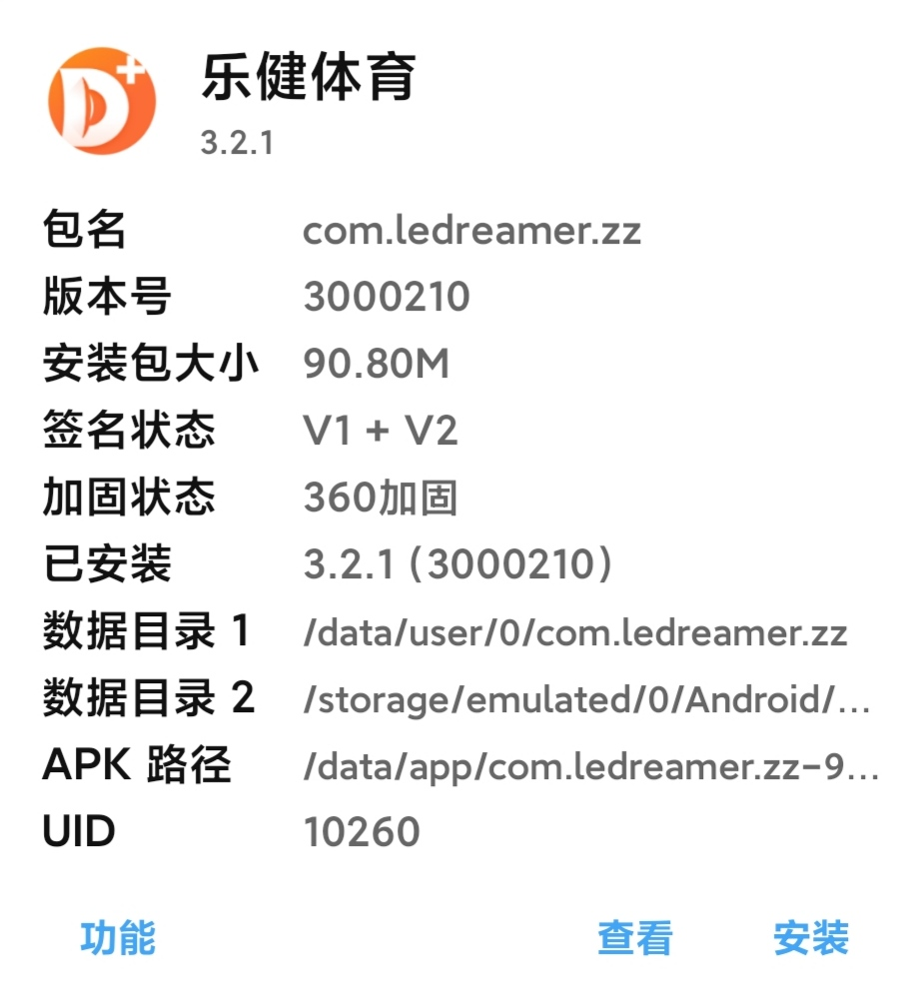

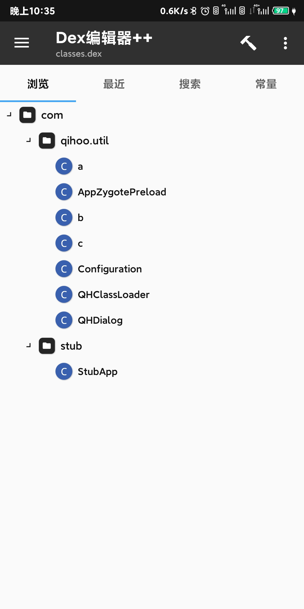

### 2. 使用frida-dexdump dump dex

1. 在夜神模拟器中安装乐健体育app, 开启夜神模拟器的root权限

2. 使用adb连接夜神模拟器 

    ```shell
    adb connect 127.0.0.1:62001
    ```

3. 去frida release 下载对应的frida-server文件

    查看本机环境的方法

    ```shell
    adb shell getprop ro.product.cpu.abi // 查看安卓环境, 本人是x86
    ```

4. 将firda-server push 到安卓文件夹 /data/local/tmp

    ```shell
    adb push frida-server /data/local/tmp
    ```

5. 运行firda-server文件

    ```shell
    adb shell // 进入shell
    su // 获取root权限
    chmod 777 frida-server // 给定文件权限
    ./frida-server // 运行文件
    ```

6. 使用frida-dexdump 脱壳

    ```
    frida-dexdump -U -f -d // frida-dexdump 会自动dump安卓中的前台程序, 需要在主界面打开乐健app
    ```

    dump成功截图, 如下图成功脱出dex

    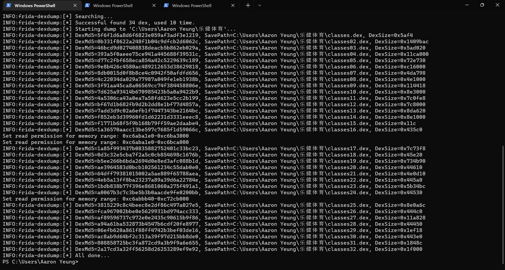


7. 将所有的dex拷贝到手机中, 使用mt管理器依次查看分析, 删除无法使用的dex文件, 最后将有用的dex文件拷贝到电脑目录中

    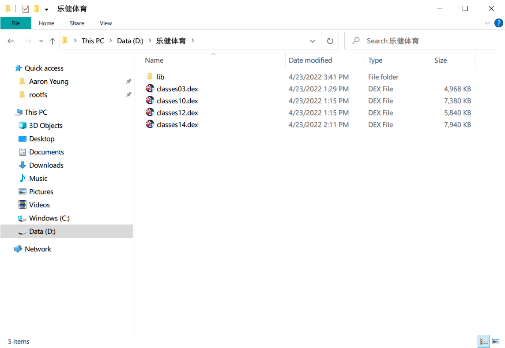


## 4. 使用jadx分析 dump出来的dex文件

1. 使用jadx打开上一步dex所在的文件夹

    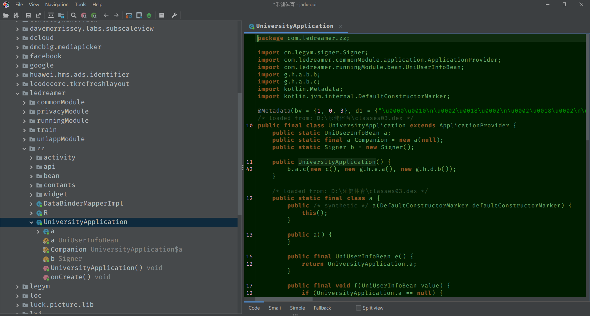


2. 使用工具栏中的搜索功能, 搜索 signDigital 关键字, 依次查看相关代码

    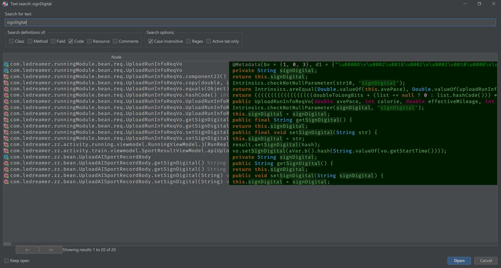


3. 我们找到一下代码就是乐健对数据的加密, 我们可以看到key的生成方式, 但是最后的结果还是得hash(key)

    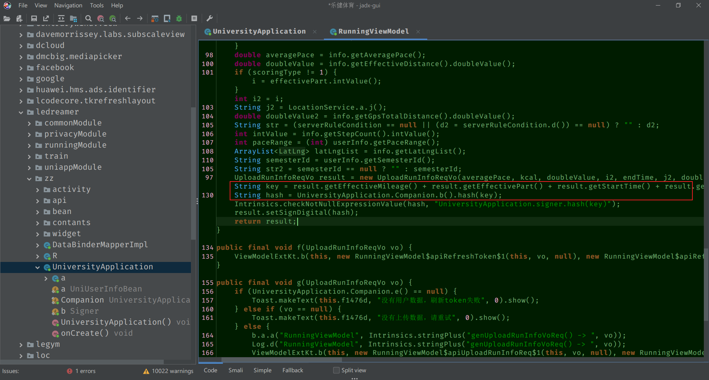


4. 分析 UniversityApplication.Companion.b().hash(key), 我们发现乐健使用了native方法,  加载了一个名为legymsigner的lib

    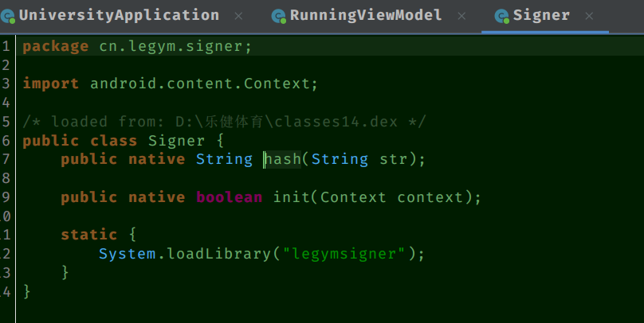

    

5. 解压apk发现legymsigner库位于lib目录下面, 并为文件名称为**legymsigner.so**

    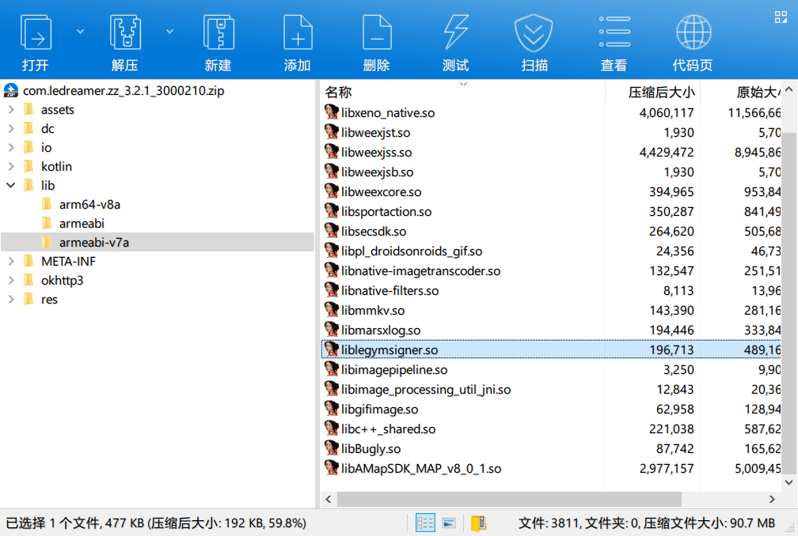

## 5. 使用IDA分析legymsigner.so文件

1. 使用32位启动ida

    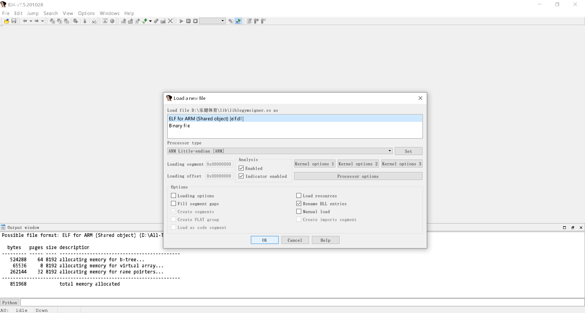

2. 搜索 Java_cn_legym_signer_Signer_hash(JNI 方法有固定的命令格式), 按 **F5** IDA自动生成伪代码

    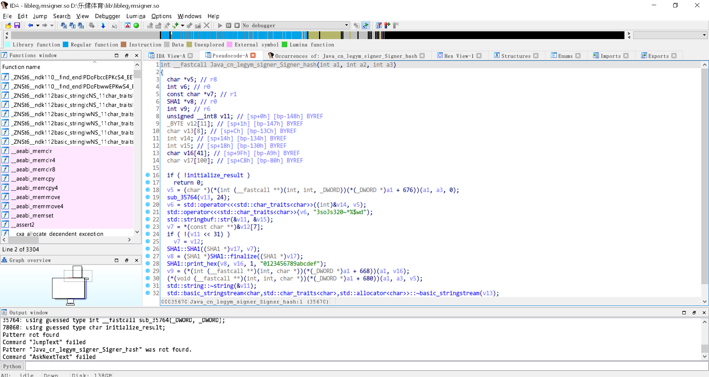

3. 查看代码

    ```c++
    std::operator<<<std::char_traits<char>>(v6, "3soJs320~*%$wd"); // hash时候的solt就是 soJs320~*%$wd
    
    // 最后的加密方式是 sha1(key+solt)
    ```


----


教程结束
